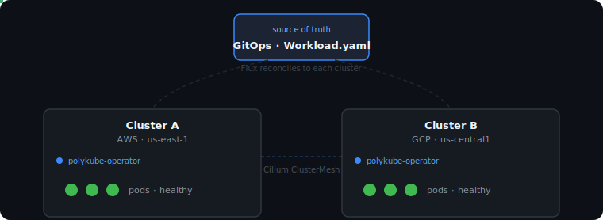

# Polykube

Kubernetes-native infrastructure for portable backend workloads across clusters, regions, and clouds.

- **No central control plane.** Each cluster runs its own Polykube operator with only local credentials. No single process holds access to all clusters at once.
- **GitOps-native.** Desired state lives in Kubernetes manifests committed to a repository and delivered by Flux. No hidden mutations, no configuration drift.
- **Cross-cloud.** Works across AWS, GCP, and any CNCF-conformant Kubernetes cluster. Provider-specific details are isolated to bootstrap tooling, not baked into the operator.
- **Opinionated networking.** Built on Cilium ClusterMesh (cross-cluster pod routing) and Netmaker (WireGuard overlay for clusters that don't share a network). These are the mechanism that makes cross-cluster traffic work.
- **Observable.** Per-cluster workload status is recorded under `Workload.status.targets[]` — queryable like any Kubernetes resource, aggregatable across clusters without a separate control plane.
- **Self-hostable.** No hosted control plane, no SaaS dependency, no required private cloud account.

Alpha/experimental — no production guarantees yet. Known limitations: [`docs/known-limitations.md`](docs/known-limitations.md).

[**Get started →**](docs/getting-started.md)

## How it works

You provision clusters and connect them with a cross-cluster networking layer (Cilium ClusterMesh for pod routing, Netmaker for inter-node connectivity where clusters don't share a network). OpenTofu or your own tooling renders the resulting cluster details into Polykube `ClusterMember` and `Federation` manifests. You review those manifests and commit them to a GitOps repository. Flux delivers the manifests and the Polykube operator to each cluster. From that point, the operator in each cluster reconciles only its local slice of workload intent — no central control plane, no process holding credentials for all clusters at once.

## Goals

- Reduce cloud, region, and cluster lock-in for backend services.
- Keep desired state in Kubernetes resources, reconciled by controllers running inside each cluster.
- Make multicluster behavior observable, testable, and reversible before it reaches production infrastructure.
- Provide reference patterns that can be adopted independently rather than requiring a hosted product.

## Repository layout

- `operator/`: Kubernetes operator and CRD implementation.
- `infra/tofu/`: OpenTofu modules for generating Polykube manifests from cluster outputs.
- `gitops/`: Flux-compatible runtime component manifests for deploying the operator.
- `examples/local-multicluster/`: local multicluster demo using k0s and Cilium.
- `examples/aws-gcp/`: reference end-to-end path for AWS and GCP clusters.
- `docs/`: architecture, roadmap, decisions, and contributor-facing docs.
- `scripts/`: local helper scripts.

## Origin and development notes

Polykube began as internal platform tooling at Kismet Engineering, a commercial venture that has since been retired. Rather than let the work disappear, the maintainers have contributed it to the public as open source.

A significant portion of the implementation was developed with LLM coding assistance, under continuous human supervision and review. We think this is worth being transparent about. The design decisions, architecture direction, and final review of all code and documentation were made by human engineers. The AI assistance accelerated implementation of the controller and reconciler logic, documentation, and local demo infrastructure.

The commit history was squashed to a single epoch commit at `v0.1.0-alpha.1` when the repository was made public. This was a deliberate choice to start the public contribution with a clean, reviewable baseline rather than expose an accumulation of work-in-progress commits from a private development period.
