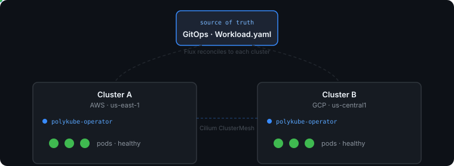

# Polykube

[](https://github.com/kismet-engineering/polykube/actions/workflows/ci.yml)
[](LICENSE)

[](https://github.com/kismet-engineering/polykube/pkgs/container/polykube-operator)

Kubernetes-native infrastructure for portable backend workloads across clusters, regions, and clouds.



Polykube delivers portable backend workload intent through GitOps to Kubernetes clusters that you have already provisioned and connected. Each member cluster runs its own operator, which reconciles only its local slice of that intent. Polykube is an experimental public alpha and is not production-ready.

- **No central control plane.** Each cluster runs its own Polykube operator with only local credentials. No single process holds access to all clusters at once.
- **GitOps-native.** Desired state lives in Kubernetes manifests committed to a repository and delivered by Flux. The operator reconciles only resources it owns and reports conflicts instead of mutating unowned objects.
- **Cross-cloud by design.** Validated locally with k0s, with a reference path for AWS and GCP. Provider-specific details are isolated to bootstrap tooling, not baked into the operator. Other conformant Kubernetes distributions are expected to work but are not validated.
- **Opinionated networking.** Built on Cilium ClusterMesh (cross-cluster pod routing) and Netmaker (WireGuard overlay for clusters that don't share a network). These are the mechanism that makes cross-cluster traffic work.
- **Observable.** Per-cluster workload status is recorded under `Workload.status.targets[]` and can be queried across explicit kubeconfig contexts with the read-only [`polykube-status`](docs/status-aggregation.md) CLI.
- **Self-hostable.** No hosted control plane, no SaaS dependency, no required private cloud account.

## Use Polykube when

- You run, or plan to run, more than one Kubernetes cluster across regions or clouds and want the same `Workload` intent delivered to each of them.
- You already deliver cluster configuration through GitOps (Flux, or a comparable tool for a manual path) and want workload placement to be reviewable in Git.
- You want each member cluster to reconcile with only its own credentials, with no process that holds access to every cluster.
- You accept Cilium ClusterMesh, plus Netmaker where clusters do not share a network, as the cross-cluster networking stack.
- You are evaluating or experimenting, not running production traffic.

## Before you start

Polykube assumes these exist outside Polykube:

- **Clusters.** You provision the Kubernetes clusters. Polykube does not create clusters, networks, IAM, DNS, certificates, or container registries.
- **Cross-cluster networking.** Cilium ClusterMesh is installed and connected, and pod CIDRs are routable between member clusters. See [`docs/networking-caveats.md`](docs/networking-caveats.md).
- **Secrets.** Every referenced `Secret` already exists locally in each member cluster. See [Secrets and credentials](docs/getting-started.md#secrets-and-credentials).
- **GitOps delivery.** Flux, or `kubectl` for a first manual apply, delivers the CRDs, the operator, and your manifests to each cluster.

## Do not use Polykube for

- **Cluster or cloud provisioning.** OpenTofu here only renders manifests from existing cluster outputs. See [Cloud Bootstrap limitations](docs/known-limitations.md#cloud-bootstrap).
- **Secret replication.** Secrets are never copied between clusters. See the [Secrets model](docs/architecture.md#secrets-model).
- **A SaaS or hosted control plane.** There is none, and there is no central service holding credentials for every cluster.
- **Progressive rollout, canary, or blue/green promotion.** Use a dedicated rollout controller. See [Routing and data limitations](docs/known-limitations.md#routing-and-data).
- **Production global traffic management.** `ServiceEndpoint` applies Cilium global-service annotations only.
- **Database provisioning or replication.** `DatastoreBinding` injects local connection details only.
- **Production clusters or credentials without independent review.** See [`docs/security.md`](docs/security.md) and [Security limitations](docs/known-limitations.md#security).

## Current implementation status

The operator currently reconciles all five alpha resources: `ClusterMember`, `Federation`, `Workload`, `ServiceEndpoint`, and `DatastoreBinding`. `Workload` creates local `Deployment` and `Service` resources, `ServiceEndpoint` applies Cilium global-service annotations, and `DatastoreBinding` injects connection env vars from local secrets. The alpha boundary is operational depth, not missing controllers: there is no production traffic manager, no database provisioning, and no secret replication. Multicluster status is available through an on-demand read-only CLI rather than a continuously running aggregation service.

Known limitations are tracked in [`docs/known-limitations.md`](docs/known-limitations.md), which is the authoritative source for current implementation boundaries.

## First-user path

Follow these steps in order. Each links to the command and expected outcome in the [getting started guide](docs/getting-started.md).

1. **[Validate the repository](docs/getting-started.md#1-validate-the-repository).** `bash scripts/validate-repo.sh` exits `0`.
2. **[Run the local multicluster demo](docs/getting-started.md#2-create-and-connect-local-clusters).** Two local k0s clusters, `alpha` and `beta`, connected by Cilium ClusterMesh with the operator running in each. No cloud account is needed. `mise run local:release:validate` runs the same path as [one gate](docs/getting-started.md#one-command-alternative).
3. **[Inspect generated resources](docs/getting-started.md#6-inspect-generated-resources).** The sample `Workload` produces an operator-owned `Deployment` and `Service` in each cluster, `ServiceEndpoint` adds Cilium global-service annotations, and `mise run local:workload:status` shows one `Available` target per cluster.
4. **[Evaluate cloud and bootstrap examples](docs/getting-started.md#next-evaluate-cloud-and-bootstrap-examples).** Read [`examples/aws-gcp/`](examples/aws-gcp/README.md), the [GitOps operator profiles](gitops/components/operator/README.md), [`docs/security.md`](docs/security.md), and [`docs/networking-caveats.md`](docs/networking-caveats.md) before connecting real clusters.

[**Get started →**](docs/getting-started.md)

## Day-2 operations

- [Diagnose degraded resources](docs/getting-started.md#diagnose-degraded-resources) through conditions and target status.
- [Reconciliation failures and recovery](docs/architecture.md#reconciliation-failures-and-recovery) lists condition reasons and how to recover from each.
- [API field support](docs/api-field-support.md) lists which spec fields are reconciled, metadata-only, or accepted for future integration.
- [Multicluster workload status](docs/status-aggregation.md) queries `Workload` status across explicit kubeconfig contexts.
- [Secrets model](docs/architecture.md#secrets-model) covers provisioning secrets in each member cluster.
- [Operator security model](docs/security.md) covers the default and namespace-scoped deployment profiles and their permissions.
- [Networking troubleshooting order](docs/networking-caveats.md#troubleshooting-order) and [validation matrix](docs/networking-caveats.md#validation-matrix) for cross-cluster connectivity.
- [Operator images](docs/release/operator-images.md) covers image tags and pinning a reviewed release.

## How it works

You provision clusters and connect them with a cross-cluster networking layer (Cilium ClusterMesh for pod routing, Netmaker for inter-node connectivity where clusters don't share a network). OpenTofu or your own tooling renders the resulting cluster details into Polykube `ClusterMember` and `Federation` manifests. You review those manifests and commit them to a GitOps repository. Flux delivers the manifests and the Polykube operator to each cluster. From that point, the operator in each cluster reconciles only its local slice of workload intent — no central control plane, no process holding credentials for all clusters at once.

## Goals

- Reduce cloud, region, and cluster lock-in for backend services.
- Keep desired state in Kubernetes resources, reconciled by controllers running inside each cluster.
- Make multicluster behavior observable, testable, and reversible before it reaches production infrastructure.
- Provide reference patterns that can be adopted independently rather than requiring a hosted product.

## Repository layout

- `operator/`: Kubernetes operator and CRD implementation.
- `infra/tofu/`: OpenTofu modules for generating Polykube manifests from cluster outputs.
- `gitops/`: Flux-compatible runtime component manifests for deploying the operator.
- `examples/local-multicluster/`: local multicluster demo using k0s and Cilium.
- `examples/aws-gcp/`: reference end-to-end path for AWS and GCP clusters.
- `docs/`: architecture, roadmap, decisions, and contributor-facing docs.
- `scripts/`: local helper scripts.

## For Contributors

Start with [`CONTRIBUTING.md`](CONTRIBUTING.md), [`docs/architecture.md`](docs/architecture.md), [`docs/known-limitations.md`](docs/known-limitations.md), and [`docs/decisions/0002-public-alpha-scope.md`](docs/decisions/0002-public-alpha-scope.md).

Before proposing changes, run:

```bash
bash scripts/validate-repo.sh
```

## Origin and development notes

Polykube began as internal platform tooling at Kismet Engineering, a commercial venture that has since been retired. Rather than let the work disappear, the maintainers have contributed it to the public as open source.

A significant portion of the implementation was developed with LLM coding assistance, under continuous human supervision and review. We think this is worth being transparent about. The design decisions, architecture direction, and final review of all code and documentation were made by human engineers. The AI assistance accelerated implementation of the controller and reconciler logic, documentation, and local demo infrastructure.

The commit history was squashed to a single epoch commit at `v0.1.0-alpha.1` when the repository was made public. This was a deliberate choice to start the public contribution with a clean, reviewable baseline rather than expose an accumulation of work-in-progress commits from a private development period.
