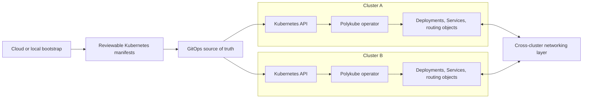
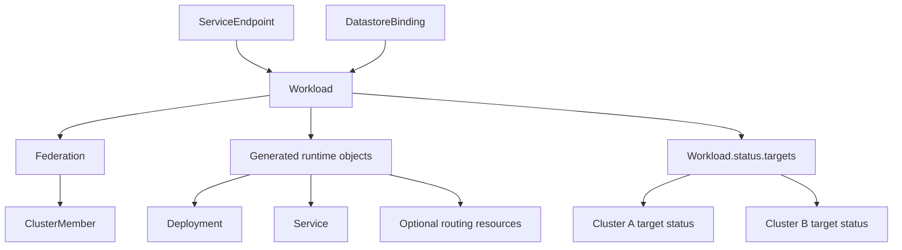
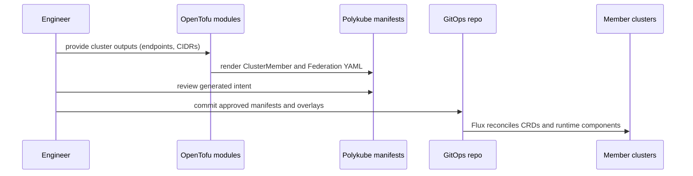
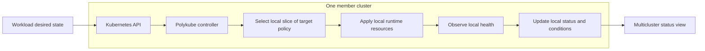

# Architecture

Polykube separates cloud bootstrap, cluster membership, workload reconciliation, and routing policy.

## System Overview



Bootstrap tooling (OpenTofu or your own scripts) produces reviewable Kubernetes manifests. Flux or another GitOps tool delivers those manifests to each cluster. From there, the Polykube operator in each cluster reconciles only its local slice of desired state — there is no central process that holds credentials for all clusters.

The same Polykube resources can be delivered to every member cluster. Each operator is started with the name of the local `ClusterMember`, then ignores work meant for other members. It does not open connections to remote Kubernetes APIs, queue work for other clusters, or need kubeconfigs for the rest of the federation.

## Control Model

The operator is the primary control plane. Desired state lives in Kubernetes resources and is reconcilable through GitOps.

Initial API groups use the `polykube.dev` root:

- `infrastructure.polykube.dev`: cluster membership and federation.
- `runtime.polykube.dev`: workloads and rollout targets.
- `routing.polykube.dev`: service endpoints and routing policy.
- `data.polykube.dev`: datastore bindings and replication intent.

The v0 CRD model is defined in `docs/decisions/0003-crd-model-v0.md`.



A `Federation` groups `ClusterMember` resources. A `Workload` declares intent against a `Federation`. The operator generates local `Deployment` and `Service` objects and records per-cluster status under `Workload.status.targets[]`.

### Networking assumptions

Polykube is opinionated about networking. Cilium with ClusterMesh enabled is the assumed cross-cluster pod networking layer — it provides global services, allowing a `Service` in one cluster to receive traffic from pods in another. Netmaker (WireGuard-based overlay) is the assumed inter-node connectivity layer for environments where clusters don't share a network and can't reach each other's pod CIDRs directly.

These are not plug-in abstractions. They are what makes the routing model work. Future iterations may support alternative networking backends, but v0 targets this specific stack.

Provider defaults matter. For example, GKE Dataplane V2 is not the same as a self-managed Cilium installation with ClusterMesh enabled, and ClusterMesh still needs a validated underlay route to every remote pod CIDR. See `networking-caveats.md` for the AWS/GCP caveats and validation matrix learned from live cross-cloud testing.

### Secrets model

**What polykube does.** All secret references — `Workload.spec.imagePullSecrets`, `Workload.spec.envFrom[].secretRef`, and `DatastoreBinding.spec.connectionRef` — are local, namespace-scoped Kubernetes `Secret` names. The operator dereferences those names only: it looks up the `Secret` in the local cluster and uses it to configure the runtime objects it manages. It does not create, replicate, or manage the contents of secrets. If a referenced secret exists locally, reconciliation proceeds; if it does not, the affected resource enters `Degraded` state with reason `SecretNotFound` (Workload) or `ConnectionSecretNotFound` (DatastoreBinding) and is requeued until the secret appears.

**What polykube does not do.** Polykube does not replicate secrets across member clusters. Doing so would require the operator to hold credentials for remote clusters, which violates the local-only reconciliation model — each cluster's operator instance touches only that cluster.

**How to provision secrets on each member cluster.** The recommended approach is [External Secrets Operator (ESO)](https://external-secrets.io). Each member cluster runs its own ESO instance with local cloud credentials (AWS Secrets Manager, GCP Secret Manager, Vault, etc.) and pulls the same logical secret from the same upstream source into the local namespace. This fits naturally into a GitOps model: `ExternalSecret` CRs are committed alongside `Workload` manifests and delivered to every cluster by Flux.

```
Secret source (Vault / AWS SM / GCP SM)
        ↓  (each cluster's ESO syncs independently)
Local Secret in each member cluster
        ↓  (Flux delivers Workload + ExternalSecret CRs)
Polykube operator dereferences local Secret
        ↓
Deployment has correct env vars / pull credentials
```

Other viable approaches: Sealed Secrets (encrypted CRs committed to GitOps), Vault Agent Injector, CSI secret store driver. The mechanism does not matter to polykube — what matters is that the `Secret` object exists in the namespace before or shortly after the `Workload` is applied.

The operator must read Secret contents in its watch scope, and `DatastoreBinding` copies its selected connection URL into a Deployment environment value. The default and namespace-scoped permission models and their trust assumptions are documented in `security.md`.

### DatastoreBinding env vars

`DatastoreBinding` injects connection env vars into the `Deployment` generated for a `Workload`:

- `DATASTORE_<NAME>_URL`: canonical Polykube binding-specific connection URL, generated for every binding. The binding name is uppercased and hyphens are converted to underscores, so a binding named `analytics-db` produces `DATASTORE_ANALYTICS_DB_URL`.
- `DATASTORE_<NAME>_REPLICATION_MODE`: binding-specific replication intent, generated for every binding from `DatastoreBinding.spec.replicationMode`.
- `DATABASE_URL`: compatibility alias generated only when the binding name is exactly `primary`. This supports applications and frameworks that expect a single default database URL.

Apps that consume multiple datastores should prefer the binding-specific `DATASTORE_<NAME>_URL` variables. Apps that only need one default database can name the binding `primary` and continue using `DATABASE_URL`.

The connection `Secret` should store the URL under `url`; the operator falls back to `DATABASE_URL` for compatibility with existing secret conventions. Binding-managed env vars intentionally take precedence over same-name entries in `Workload.spec.env`. For example, if a `Workload` defines `DATABASE_URL` and a `DatastoreBinding` named `primary` is reconciled, the `DatastoreBinding` value wins because the binding represents the selected local connection secret.

### Reconciliation failures and recovery

Controllers report invalid references and ownership conflicts through Kubernetes conditions instead of silently mutating unrelated objects. `Workload` records the local target as `Degraded`; `ServiceEndpoint` and `DatastoreBinding` set `Degraded=True` and `Ready=False`. Recoverable states are retried, and successful reconciliation removes the stale `Degraded` condition.

| Resource | Reasons | Recovery |
| --- | --- | --- |
| `Workload` | `FederationNotFound`, `ClusterMemberNotFound`, `InvalidFederationSelector`, `InvalidTargetPolicy` | Create or correct the referenced infrastructure resource or selector. A cluster intentionally excluded by Federation membership or target policy remains `Pending`, not degraded. |
| `Workload` | `SecretNotFound`, `ConfigMapNotFound` | Create the named object in the Workload namespace. Reconciliation resumes without changing the Workload manifest. |
| `Workload` | `DeploymentOwnershipConflict`, `ServiceOwnershipConflict` | Rename or remove the same-name object. Polykube does not adopt runtime objects it does not control. |
| `ServiceEndpoint` | `WorkloadNotFound`, `ServiceNotFound`, `ServiceOwnershipConflict` | Create or correct the Workload and wait for its controlled Service, or remove the conflicting Service. |
| `ServiceEndpoint` | `PrimaryMemberNotFound`, `FederationNotFound`, `InvalidFederationSelector`, `PrimaryMemberNotInFederation` | For active/passive routing, ensure the primary `ClusterMember` exists and belongs to the Workload's Federation, either explicitly or through its member selector. |
| `DatastoreBinding` | `WorkloadNotFound`, `ConnectionSecretNotFound`, `DeploymentNotFound`, `DeploymentOwnershipConflict` | Create or correct the dependency and ensure the Deployment is controlled by the referenced Workload. |

The ownership check is deliberate. The Workload controller owns its generated `Deployment` and optional `Service`. `ServiceEndpoint` may annotate only that controlled Service, and `DatastoreBinding` may inject or remove env vars only on that controlled Deployment. Finalizer cleanup follows the same rule and never modifies an object that is no longer controlled by the referenced Workload.

## Bootstrap Model

Infrastructure bootstrap tools should produce deterministic, reviewable artifacts before anything is applied to clusters.



Cluster provisioning (creating the clusters, installing Cilium, connecting Netmaker) happens before the OpenTofu manifest generation step. The tofu modules in this repository convert already-provisioned cluster details into Polykube CRD manifests — they do not create clusters, networks, IAM, or DNS.

## Runtime Model

Each participating cluster runs local reconciliation with only the credentials needed for that cluster. Multicluster rollout state is aggregated from per-cluster target status rather than a central process holding all cluster credentials.

For v0, per-cluster rollout state lives under `Workload.status.targets[]`. A separate deployment target resource can be introduced later if implementation evidence shows the status array is insufficient.

Polykube does not aim to be a progressive rollout engine. It should interoperate with dedicated rollout controllers for canaries, blue/green promotion, approvals, and traffic-shift gates while retaining responsibility for multicluster placement and runtime wiring.



The operator reads workload intent from the Kubernetes API, selects the targets that apply to this cluster, applies local `Deployment` and `Service` resources, observes their health, and writes per-cluster status back. A separate read path aggregates status across clusters for visibility — no cluster's operator needs to contact another cluster's API server.
