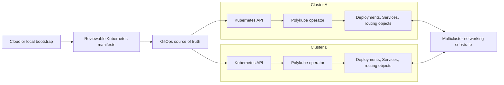
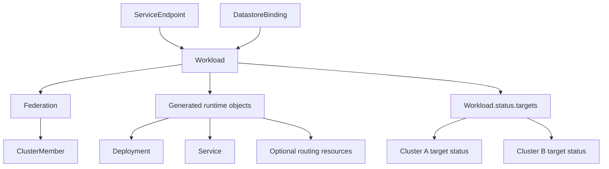
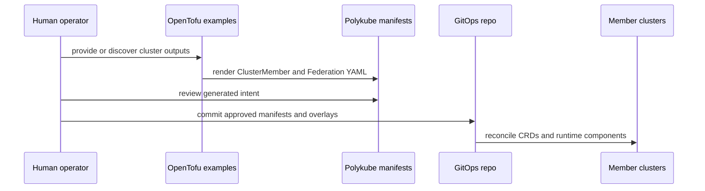
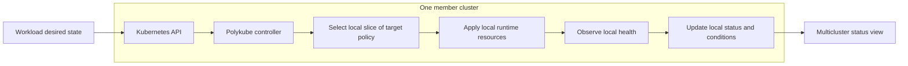

# Architecture

Polykube separates cloud bootstrap, cluster membership, workload reconciliation, and routing policy.

## System Overview

Polykube keeps the durable control surface in Kubernetes manifests and status. Bootstrap tooling can help create manifests, but the operator boundary stays inside each participating cluster.

## Control Model

The operator is the primary control plane. Desired state should live in Kubernetes resources and be reconcilable through GitOps.

Initial API groups use the `polykube.dev` root:

- `infrastructure.polykube.dev`: cluster membership and federation substrate.
- `runtime.polykube.dev`: workloads and rollout targets.
- `routing.polykube.dev`: service endpoints and routing policy.
- `data.polykube.dev`: datastore bindings and replication intent.

The v0 CRD model is defined in `docs/decisions/0003-crd-model-v0.md`.

## Bootstrap Model

Infrastructure bootstrap tools should produce deterministic artifacts that can be reviewed and applied as Kubernetes manifests.

## Runtime Model

Each participating cluster runs local reconciliation with only the credentials needed for that cluster. Multicluster rollout state is aggregated from per-cluster target status rather than a central process holding all cluster credentials.

For v0, per-cluster rollout state lives under `Workload.status.targets[]`. A separate deployment target resource can be introduced later if implementation evidence shows the status array is insufficient.

Polykube does not aim to be a progressive rollout engine. It should interoperate with dedicated rollout controllers for canaries, blue/green promotion, approvals, and traffic-shift gates while retaining responsibility for multicluster placement and runtime wiring.

