# Getting Started

This guide walks through two things: validating the repository, and running the local multicluster demo. The local demo creates two Kubernetes clusters on your machine, connects them with Cilium ClusterMesh, and deploys the Polykube operator into each — giving you a working multicluster environment without a cloud account.

## Prerequisites

- Git
- Go matching `operator/go.mod`
- Docker-compatible runtime
- `kubectl`
- `mise`
- `colima` on macOS when using Colima as the Docker runtime

## Validate The Repository

```bash
bash scripts/validate-repo.sh
```

This is the static/unit repository gate. It checks repository scaffold, high-confidence sanitization patterns, whitespace, shell syntax, Go formatting, the full operator unit test suite, required release files, optional CRD dry-run, optional OpenTofu formatting, and optional GitOps kustomization rendering depending on installed tools.

## Run The Local Demo

The local demo exercises cluster creation, cross-cluster networking, and the operator before any cloud rollout.

```mermaid
flowchart LR
    Create[Create local k0s clusters] --> Kubeconfig[Export combined kubeconfig]
    Kubeconfig --> Preflight[Cilium preflight]
    Preflight --> Install[Install Cilium]
    Install --> Mesh[Enable and connect ClusterMesh]
    Mesh --> Verify[Verify cross-cluster connectivity]
    Verify --> Operator[Deploy Polykube operator]
    Operator --> Demo[Apply sample Workload]
    Demo --> Probe[Probe global-service routing]
```



Create two local clusters:

```bash
mise run local:cluster:create -- --clusters alpha,beta --workers 0
mise run local:cluster:status
```

Point `kubectl` at both clusters by exporting the generated kubeconfigs:

```bash
export KUBECONFIG=$(ls -1 examples/local-multicluster/state/kubeconfigs/*.yaml | paste -sd: -)
```

Install Cilium and connect the clusters so pods can reach each other across cluster boundaries:

```bash
mise run local:cilium:preflight -- --clusters alpha,beta
mise run local:cilium:install -- --clusters alpha,beta
mise run local:cilium:clustermesh:enable -- --clusters alpha,beta --service-type NodePort
mise run local:cilium:clustermesh:connect -- --source alpha --destination beta
mise run local:cilium:verify -- --source alpha --destination beta
mise run local:cilium:global-service:probe -- --source alpha --destination beta
```

## Render Runtime Components

Preview what the GitOps operator component looks like before deploying it:

```bash
kubectl kustomize gitops/components/operator
```

This default profile watches all namespaces. If all managed applications can share one namespace, render the least-privilege profile instead:

```bash
kubectl kustomize gitops/overlays/operator-namespace-scoped
```

Review `security.md` before installing either profile.

Build the operator image and render the manifests with the local image tag:

```bash
mise run operator:test
mise run operator:image:build -- --image polykube-operator:dev
mise run operator:render -- --image polykube-operator:dev
```

Load the image into each local cluster's container runtime and deploy the operator:

```bash
mise run local:operator:image:load -- --clusters alpha,beta --image polykube-operator:dev
mise run local:operator:deploy -- --clusters alpha,beta --image polykube-operator:dev
```

Apply the sample `ClusterMember`, `Federation`, `Workload`, and `ServiceEndpoint` manifests to both clusters:

```bash
mise run local:demo:apply
```

If OpenTofu is installed, check formatting for the manifest generation module:

```bash
tofu fmt -check -recursive infra/tofu
```

## Secrets and credentials

Polykube does not replicate secrets across clusters. Any `Secret` referenced in `Workload.spec.imagePullSecrets`, `Workload.spec.envFrom[].secretRef`, or `DatastoreBinding.spec.connectionRef` must exist locally in the same namespace before the operator reconciles it — otherwise the resource enters `Degraded` state and is requeued. See [Secrets model](architecture.md#secrets-model) in the architecture guide for the recommended provisioning approach using External Secrets Operator.

## Diagnose degraded resources

Inspect conditions and local target status before checking controller logs:

```bash
kubectl -n <namespace> get workload <name> -o yaml
kubectl -n <namespace> get serviceendpoint <name> -o yaml
kubectl -n <namespace> get datastorebinding <name> -o yaml
```

Condition reasons identify missing dependencies, invalid Federation relationships, and same-name runtime objects that Polykube does not own. Correct the referenced object or remove the ownership conflict; the controllers retry recoverable states and clear `Degraded` after reconciliation succeeds. See [Reconciliation failures and recovery](architecture.md#reconciliation-failures-and-recovery) for the reason and recovery matrix.

## Current Boundary

The local demo validates cluster lifecycle, Cilium ClusterMesh, operator deployment, sample Workload reconciliation, ServiceEndpoint Cilium annotations, and global-service routing. Known limitations are tracked in `docs/known-limitations.md`.

Operator image publishing and tag conventions are documented in `docs/release/operator-images.md`.
