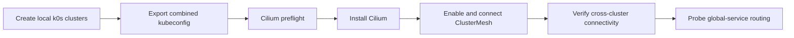

# Getting Started

Polykube is in private alpha. This guide is the shortest current path to validate the repository and exercise the local multicluster substrate demo.

## Prerequisites

- Git
- Go matching `operator/go.mod`
- Docker-compatible runtime
- `kubectl`
- `mise`
- `colima` on macOS when using Colima as the Docker runtime

## Validate The Repository

```bash
bash scripts/validate-repo.sh
```

This checks repository sanitization, shell syntax, Go formatting, Go tests, required release files, optional CRD dry-run, optional OpenTofu formatting, and optional GitOps kustomization rendering depending on installed tools.

## Run The Local Substrate Demo

The local demo exercises the substrate pieces before any cloud rollout.



Create two local clusters:

```bash
mise run local:cluster:create -- --clusters alpha,beta --workers 0
mise run local:cluster:status
```

Export the generated kubeconfigs:

```bash
export KUBECONFIG=$(ls -1 examples/local-multicluster/state/kubeconfigs/*.yaml | paste -sd: -)
```

Install and verify the local networking substrate:

```bash
mise run local:cilium:preflight -- --clusters alpha,beta
mise run local:cilium:install -- --clusters alpha,beta
mise run local:cilium:clustermesh:enable -- --clusters alpha,beta --service-type NodePort
mise run local:cilium:clustermesh:connect -- --source alpha --destination beta
mise run local:cilium:verify -- --source alpha --destination beta
mise run local:cilium:global-service:probe -- --source alpha --destination beta
```

## Render Runtime Components

Render the GitOps operator component:

```bash
kubectl kustomize gitops/components/operator
```

Build and render the local operator image path through mise:

```bash
mise run operator:test
mise run operator:image:build -- --image polykube-operator:dev
mise run operator:render -- --image polykube-operator:dev
```

After creating local clusters, load and deploy the local image into each k0s runtime:

```bash
mise run local:operator:image:load -- --clusters alpha,beta --image polykube-operator:dev
mise run local:operator:deploy -- --clusters alpha,beta --image polykube-operator:dev
```

If OpenTofu is installed, check formatting for the bootstrap scaffold:

```bash
tofu fmt -check -recursive infra/tofu
```

## Current Boundary

The local substrate demo validates cluster lifecycle, Cilium/ClusterMesh, and global-service routing. Operator-backed workload installation across all local members is still tracked as a known limitation in `docs/known-limitations.md`.

Operator image publishing and tag conventions are documented in `docs/release/operator-images.md`.
