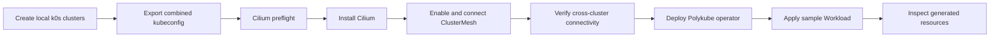

# Getting Started

This guide is the first-user path for Polykube:

1. Validate the repository.
2. Run the local multicluster demo.
3. Inspect the resources the operator generates.
4. Evaluate the cloud and bootstrap examples.

The local demo creates two Kubernetes clusters on your machine, connects them with Cilium ClusterMesh, and deploys the Polykube operator into each. You get a working multicluster environment without a cloud account.

Polykube is an experimental public alpha. The demo shows the reconciliation and routing model. It is not a production installation. See the [README](../README.md#before-you-start) for the assumptions Polykube makes about clusters, networking, and secrets, and [`known-limitations.md`](known-limitations.md) for current boundaries.

## Prerequisites

- Git
- Go matching `operator/go.mod`
- Docker-compatible runtime
- `kubectl`
- `mise`
- `colima` on macOS when using Colima as the Docker runtime. See the [Colima inotify note](../examples/local-multicluster/README.md#colima-inotify-capacity).

## 1. Validate the repository

```bash
bash scripts/validate-repo.sh
```

This is the static and unit-test repository gate. It checks:

- repository scaffold and required release files
- high-confidence sanitization patterns
- whitespace and shell syntax
- Go formatting and the full operator unit test suite
- optionally, depending on which tools are installed: a CRD dry-run, OpenTofu formatting, and GitOps kustomization rendering

**Expected outcome:** the script exits `0`. Optional checks are skipped when their tools are not installed.

## 2. Create and connect local clusters

The local demo exercises cluster creation, cross-cluster networking, and the operator before any cloud rollout.


```mermaid
flowchart LR
    Create[Create local k0s clusters] --> Kubeconfig[Export combined kubeconfig]
    Kubeconfig --> Preflight[Cilium preflight]
    Preflight --> Install[Install Cilium]
    Install --> Mesh[Enable and connect ClusterMesh]
    Mesh --> Verify[Verify cross-cluster connectivity]
    Verify --> Operator[Deploy Polykube operator]
    Operator --> Demo[Apply sample Workload]
    Demo --> Inspect[Inspect generated resources]
```

Create two local clusters:

```bash
mise run local:cluster:create -- --clusters alpha,beta --workers 0
mise run local:cluster:status
```

Point `kubectl` at both clusters by exporting the generated kubeconfigs:

```bash
export KUBECONFIG=$(ls -1 examples/local-multicluster/state/kubeconfigs/*.yaml | paste -sd: -)
```

Install Cilium and connect the clusters so pods can reach each other across cluster boundaries:

```bash
mise run local:cilium:preflight -- --clusters alpha,beta
mise run local:cilium:install -- --clusters alpha,beta
mise run local:cilium:clustermesh:enable -- --clusters alpha,beta --service-type NodePort
mise run local:cilium:clustermesh:connect -- --source alpha --destination beta
mise run local:cilium:verify -- --source alpha --destination beta
mise run local:cilium:global-service:probe -- --source alpha --destination beta
```

**Expected outcome:** `local:cluster:status` lists both clusters, and the `verify` and `global-service:probe` tasks exit successfully. The `polykube-alpha` and `polykube-beta` contexts are available to `kubectl`.

## 3. Build and deploy the operator

Build the operator image, load it into each local cluster's container runtime, and deploy it. Each instance is told its own identity via `--cluster-member-name`:

```bash
mise run operator:test
mise run operator:image:build -- --image polykube-operator:dev
mise run local:operator:image:load -- --clusters alpha,beta --image polykube-operator:dev
mise run local:operator:deploy -- --clusters alpha,beta --image polykube-operator:dev
```

**Expected outcome:** one operator pod is `Running` in `polykube-system` on each cluster:

```bash
kubectl --context polykube-alpha -n polykube-system get pods
kubectl --context polykube-beta  -n polykube-system get pods
```

## 4. Apply the sample manifests

Apply the sample `ClusterMember`, `Federation`, `Workload`, and `ServiceEndpoint` manifests to both clusters:

```bash
mise run local:demo:apply
```

The same manifests are applied to both clusters. Each operator reconciles only the part that targets its own `ClusterMember`.

## 5. Check membership

```bash
kubectl --context polykube-alpha get clustermember alpha -o yaml | grep -A5 conditions
kubectl --context polykube-alpha get federation local-dev -o yaml | grep -E 'readyMembers|members'
```

**Expected outcome:** each `ClusterMember` reports `Ready=True`, and `Federation local-dev` reports `readyMembers: 2`.

## 6. Inspect generated resources

The operator turns the `echo` `Workload` into a local `Deployment` and `Service` in each cluster. `ServiceEndpoint` then annotates that `Service` for Cilium global-service routing.

```bash
kubectl --context polykube-alpha -n default get deployment,service echo
kubectl --context polykube-beta  -n default get deployment,service echo
kubectl --context polykube-alpha -n default get service echo -o yaml | grep cilium
```

View both local target statuses in one table:

```bash
mise run local:workload:status
```

**Expected outcome:**

- The `echo` `Deployment` and `Service` exist in both clusters and are controlled by the `Workload`.
- The `Service` carries `service.cilium.io/global: "true"` and `service.cilium.io/shared: "true"`.
- `local:workload:status` shows one `echo` target per context, in state `Available` once pods are running (`Reconciling` before that).

The full checklist, including a cross-cluster HTTP probe, is in the local demo's [What success looks like](../examples/local-multicluster/README.md#what-success-looks-like) section. The status CLI is documented in [`status-aggregation.md`](status-aggregation.md).

### One-command alternative

`local:release:validate` runs steps 2–6, plus DatastoreBinding and GitOps rendering checks, as a repeatable gate:

```bash
mise run local:release:validate -- --clusters alpha,beta --workers 0
```

It exits nonzero on failure and records evidence under `examples/local-multicluster/state/release-evidence/`. See [`release/e2e-validation.md`](release/e2e-validation.md).

### Clean up

```bash
mise run local:cluster:delete -- --clusters alpha,beta
```

## Render runtime components for GitOps

Preview the GitOps operator component that Flux would deliver to a cluster:

```bash
kubectl kustomize gitops/components/operator
```

This default profile watches all namespaces. If all managed applications can share one namespace, render the least-privilege profile instead:

```bash
kubectl kustomize gitops/overlays/operator-namespace-scoped
```

Review [`security.md`](security.md) before installing either profile. To render the operator manifests with a locally built image tag:

```bash
mise run operator:render -- --image polykube-operator:dev
```

Operator image publishing and tag conventions are documented in [`release/operator-images.md`](release/operator-images.md).

## Secrets and credentials

Polykube does not replicate secrets across clusters. Any `Secret` referenced in these fields must already exist locally, in the same namespace, before the operator reconciles it:

- `Workload.spec.imagePullSecrets`
- `Workload.spec.envFrom[].secretRef`
- `DatastoreBinding.spec.connectionRef`

If the `Secret` is missing, the resource enters `Degraded` state and is requeued. See [Secrets model](architecture.md#secrets-model) in the architecture guide for the recommended provisioning approach using External Secrets Operator.

## Diagnose degraded resources

Inspect conditions and local target status before checking controller logs:

```bash
kubectl -n <namespace> get workload <name> -o yaml
kubectl -n <namespace> get serviceendpoint <name> -o yaml
kubectl -n <namespace> get datastorebinding <name> -o yaml
```

Condition reasons identify missing dependencies, invalid Federation relationships, and same-name runtime objects that Polykube does not own. To recover, correct the referenced object or remove the ownership conflict. The controllers retry recoverable states and clear `Degraded` once reconciliation succeeds. See [Reconciliation failures and recovery](architecture.md#reconciliation-failures-and-recovery) for the reason and recovery matrix.

## Next: evaluate cloud and bootstrap examples

After the local demo works, try the [day-2 walkthrough](../examples/local-multicluster/day-2.md): update the image, change target members, recover from a missing Secret, switch the active/passive primary, and roll back. Then evaluate the path to real clusters:

- [`examples/aws-gcp/README.md`](../examples/aws-gcp/README.md): reference flow for provisioning and connecting clusters, then generating `ClusterMember` and `Federation` manifests with OpenTofu and delivering them through Flux. If OpenTofu is installed, check the module's formatting with `tofu fmt -check -recursive infra/tofu`.
- [`networking-caveats.md`](networking-caveats.md): provider CNI caveats and the validation matrix to run before trusting cross-cluster routing.
- [`security.md`](security.md): operator permissions and the namespace-scoped profile.

The cloud path is a reference example, not a supported production installation. Polykube does not create clusters, networks, IAM, DNS, certificates, or registries.

## Current boundary

The local demo validates:

- cluster lifecycle
- Cilium ClusterMesh
- operator deployment
- sample Workload reconciliation
- ServiceEndpoint Cilium annotations
- global-service routing

It does not replace live cloud validation. Known limitations are tracked in [`known-limitations.md`](known-limitations.md).
